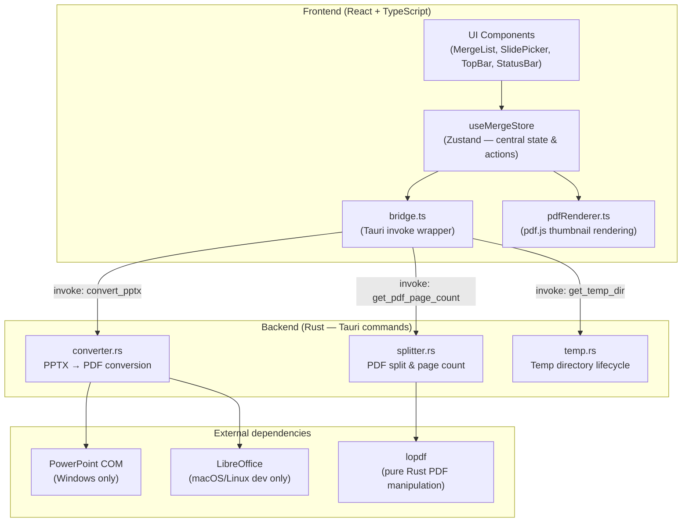

# PDF + PPTX Merger

A cross-platform desktop application that merges multiple PDF files with PowerPoint slides interspersed between them into a single PDF output.

Built with **Tauri v2** (Rust backend) and **React + TypeScript** (frontend). Primary target is **Windows**, where PPTX conversion is done natively via COM automation against Microsoft PowerPoint. macOS is supported for development and testing using LibreOffice.

---

## What it does

1. Load a `.pptx` file — the app converts it to PDF and splits it into individual slide pages
2. Build a merge sequence by combining PDF files and slide groups in any order
3. Generate a single merged PDF output

---

## Architecture overview



---

## Architecture explained

### Frontend

| Module | Role |
|---|---|
| `src/store/useMergeStore.ts` | Central Zustand store — holds all app state (`pptxPath`, `slidePdfs`, `items`, `usedSlideIndices`) and drives every async action |
| `src/services/bridge.ts` | Thin wrapper around Tauri's `invoke` API and the file dialog plugin |
| `src/services/pdfRenderer.ts` | Renders PDF pages to canvas thumbnails via pdf.js |
| `src/hooks/useThumbnail.ts` | React hook that triggers on-demand thumbnail loading |
| `src/types/index.ts` | Shared types: `MergeItem`, `PdfItem`, `SlideGroupItem`, `AppStatus` |
| `src/components/` | UI components: `MergeList`, `SlidePicker`, `TopBar`, `StatusBar` |

**State model:**

- `pptxPath` — path to the loaded PPTX file
- `slidePdfs` — array of per-slide PDF paths in the temp directory (index = 0-based slide number)
- `usedSlideIndices` — `Set` of slide indices already assigned to a group (prevents reuse)
- `items` — ordered flat list of `MergeItem` (either a `PdfItem` or a `SlideGroupItem`)

**Data flow:**

```
User loads PPTX
  → Bridge.convertPptx()        (Rust: PowerPoint COM / LibreOffice)
  → Bridge.splitPdfIntoPages()  (Rust: lopdf split)
  → slidePdfs populated

User adds PDFs → appended to items as PdfItem
User adds slide group → SlideGroupItem appended, indices added to usedSlideIndices
User generates → flat list of page paths → Bridge.mergePdfs() → output PDF written
```

### Backend (Rust)

| Module | Role |
|---|---|
| `src-tauri/src/converter.rs` | Converts PPTX to PDF. On Windows: uses `windows-rs` to drive PowerPoint via COM in a dedicated STA thread. On macOS/Linux: shells out to LibreOffice |
| `src-tauri/src/splitter.rs` | Splits a PDF into single-page files using `lopdf`; also exposes `get_pdf_page_count`. Implements full object-dependency graph traversal (`collect_deps`) to correctly isolate each page including inherited Resources and MediaBox |
| `src-tauri/src/temp.rs` | Creates a per-session temp directory at startup and cleans it on exit |
| `src-tauri/src/lib.rs` | Tauri builder — registers all commands and plugins |

**Tauri commands exposed to the frontend:**

| Command | Returns | Description |
|---|---|---|
| `convert_pptx(pptx_path)` | `String` | Converts PPTX to a single PDF, returns output path |
| `get_pdf_page_count(pdf_path)` | `usize` | Returns the number of pages in a PDF |
| `get_temp_dir()` | `String` | Returns the current session temp directory path |

---

## Running locally

### Prerequisites

| Requirement | Details |
|---|---|
| Node.js | v18+ recommended |
| Rust | Install via [rustup](https://rustup.rs/) |
| Tauri CLI | Installed automatically via `npm install` |
| **Windows** | Microsoft PowerPoint installed (required for PPTX conversion) |
| **macOS** | LibreOffice installed (`brew install --cask libreoffice`) — lower fidelity than PowerPoint |

### Install dependencies

```bash
npm install
```

### Run in development

```bash
npm run tauri dev
```

### Type-check the frontend

```bash
npx tsc --noEmit
```

### Check the Rust backend

```bash
cd src-tauri && cargo check
```

### Build for production

```bash
npm run tauri build
```

---

## Known limitations

- **Blocking async**: `convert_pptx` and lopdf I/O run on a dedicated thread but the pattern isn't fully `spawn_blocking`-wrapped everywhere — can block the Tauri runtime on large files
- **No streaming progress**: long operations report only a binary status, no incremental progress
- **Slide reuse blocked**: `usedSlideIndices` prevents the same slide from appearing in multiple groups
- **Stale temp files**: reloading a PPTX with fewer slides leaves orphaned `slide_XXXX.pdf` files in temp
- **macOS fidelity**: LibreOffice conversion produces different rendering than PowerPoint (font substitution, layout shifts)
